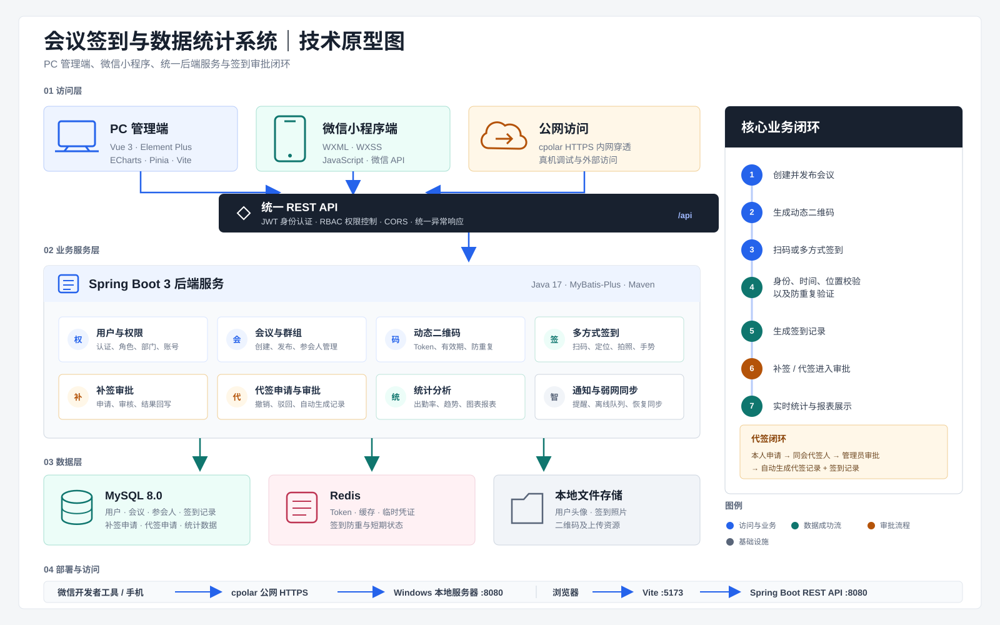

# 基于二维码的会议签到与数据统计系统

面向会议组织者和参会人员的签到管理系统，包含 PC 管理端、微信小程序端和 Spring Boot 后端。系统支持二维码、定位、拍照、手势等签到方式，并提供补签审批、代签申请、出勤统计、群组协作和弱网同步能力。

## 项目结构

```text
.
├── admin/        # Vue 3 + Element Plus PC 管理端
├── backend/      # Spring Boot 3 + MyBatis-Plus 后端
└── miniprogram/  # 微信小程序
```

## 技术栈

- PC：Vue 3、Vite、Element Plus、ECharts、Pinia
- 小程序：WXML、WXSS、JavaScript
- 后端：Java 17、Spring Boot 3、MyBatis-Plus、JWT
- 数据：MySQL 8、Redis

## 技术原型图



## 本地运行

### 后端

准备 MySQL 和 Redis，并按需设置 `DB_URL`、`DB_USERNAME`、`DB_PASSWORD`、`JWT_SECRET` 等环境变量。

```bash
cd backend
mvn spring-boot:run
```

默认接口地址：`http://localhost:8080/api`

### PC 管理端

```bash
cd admin
npm install
npm run dev
```

默认访问地址：`http://localhost:5173`

### 微信小程序

使用微信开发者工具导入 `miniprogram` 目录。开发者工具默认访问本机后端，真机调试时需要在 `miniprogram/app.js` 中配置可访问的 HTTPS API 地址。

## 主要功能

- 用户认证与角色权限
- 群组和会议管理
- 动态二维码及多方式签到
- 补签申请与审批
- 代签申请、撤销、审批和记录闭环
- 出勤统计、趋势分析和报表
- 会议提醒与弱网签到同步
